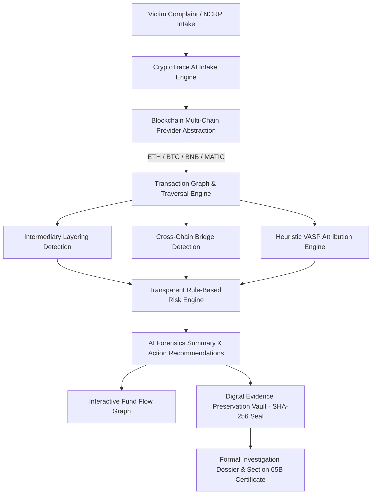

# CryptoTrace AI 🛡️
> **Real-Time Blockchain Intelligence for Cybercrime Investigations**

CryptoTrace AI is a specialized, law-enforcement-oriented digital forensics and blockchain intelligence web platform. It accepts victim-reported cryptocurrency wallet addresses, automatically analyzes multi-chain transaction histories, traces directional fund flows across intermediary layering wallets, unmasks downstream exchange/VASP destinations using clustering heuristics, computes transparent risk scores, visualizes interactive transaction graphs, and seals court-admissible forensic investigation reports.

---

## 🏛️ System Architecture



---

## 🚀 Key Capabilities & Features

1. **Suspect Wallet Forensics Pipeline**:
   - Automated 9-stage analysis: checksum validation, chain identification, transaction indexing, graph traversal, layering detection, VASP clustering, pattern recognition, risk evaluation, and intelligence report generation.
2. **Interactive Fund Flow Graph**:
   - Directed visual graph tracing: **Victim → Suspect Wallet → Intermediary A → Intermediary B → Cross-Chain Bridge → BNB Relay → Binance Deposit Cluster**.
   - One-click **"Shortest Path to Known VASP"** highlighter with glowing vector connectors and node inspection telemetry flyouts.
3. **VASP / Exchange Attribution**:
   - Categorizes attribution confidence: `CONFIRMED ATTRIBUTION`, `LIKELY ATTRIBUTION`, `POSSIBLE ATTRIBUTION`, and `UNKNOWN`.
   - Surfaces sweeper hot wallet signatures, cluster matches, hop distances, and authorized law enforcement liaison contact data.
4. **Transparent Rule-Based Risk Engine**:
   - Explainable scoring: Rapid fund movement (+15), Multiple intermediary layering (+15), High-risk cluster proximity (+20), Mixer interaction indicator (+10), Cross-chain bridging (+10), Registered complaint match (+20).
   - Generates contributing indicator checklists with exact point weights.
5. **Digital Evidence Preservation (Chain of Custody)**:
   - Cryptographically signs transactions and block metadata with SHA-256 hashes (`EV-2026-00182`).
   - Generates verifiable `.JSON` forensic snapshots for courtroom submission.
6. **Investigation Report Generation**:
   - Comprehensive Law Enforcement Blockchain Intelligence Dossier with case metadata, wallet balance, transaction summary, intermediary table, cross-chain movements, VASP findings, and formal disclaimers.
   - One-click **Print / Export to PDF**, **JSON**, and **CSV**.
7. **Government & External Connector Architecture**:
   - Modular mock adapters for **NCRP** (National Cybercrime Reporting Portal), **SAHYOG**, **VASP Intelligence Database**, and **RPC Indexers**.
   - Zero dependence on restricted government internal networks for hackathon demonstrations.

---

## 🛠️ Technology Stack

- **Frontend**: React 18, Vite, TypeScript, Tailwind CSS, React Router, Recharts, Lucide React, Custom Interactive Vector Canvas Graph.
- **Backend**: Node.js, Express, TypeScript, TSX, CORS, Dotenv, Crypto (SHA-256 subsystem).
- **Architecture**: Provider abstraction (`BlockchainProvider` → `MockBlockchainProvider` with pluggable `Infura`/`Alchemy` public RPC fallbacks).
- **Design Aesthetic**: Professional Dark Cyber-Forensics UI, High Contrast, Blue/Cyan law-enforcement accents, Red/Amber risk indicators, FIPS-140 compliance seals.

---

## ⚡ Quick Start & How to Run

### Prerequisites
- Node.js `v18+` or `v20+` (tested on Node v24)
- npm `v9+`

### 1. Start the Backend Server
```bash
cd backend
npm install
npm run dev
```
*Backend starts on `http://localhost:5000`*

### 2. Start the Frontend Application
```bash
cd frontend
npm install
npm run dev
```
*Frontend starts on `http://localhost:5173`*

---

## 🔑 Demo Credentials

| Field | Value |
|---|---|
| **Officer ID** | `demo-investigator` |
| **Password** | `demo123` |
| **Role** | Cybercrime Forensic Analyst |
| **One-Click Demo** | Button provided on login page |

---

## 🎯 5-Minute Hackathon Demo Scenario

Follow this streamlined walkthrough for presentations and judge evaluations:

1. **Login**: Go to `http://localhost:5173/login`, click **"One-Click Hackathon Login"**.
2. **Dashboard**: Observe KPIs (*128 Total Cases, ₹1.84 Cr Traced, 47 High-Risk Wallets*) and the live mempool indexer stream.
3. **Load Demo Investigation**: Click the prominent **"Load Demo Investigation"** banner.
4. **Automated Analysis Pipeline**:
   - Observe the 9-stage animated forensic progress bar.
   - Review the **Wallet Intelligence Card**: `0xDEMO71A8...`, Risk Score `87/100` (**CRITICAL**), `$42,850` received.
   - Check the **Contributing Indicators** checklist showing why the score was assigned.
5. **Interactive Fund Flow**:
   - Scroll to the interactive graph.
   - Toggle **"Shortest Path to Known VASP"** to highlight the liquidation trail.
   - Click the **Binance VASP** node to inspect attribution telemetry (92% confidence, 3 hops, $12,430 swept).
6. **Intermediary Layering & Cross-Chain**:
   - Inspect detected layering wallets showing `<2 min` holding times and `>96%` forwarding ratios.
   - View cross-chain bridge activity (Ethereum → BNB Chain).
7. **Preserve Evidence**:
   - Click **"Preserve Evidence"** to generate a cryptographic record with a SHA-256 seal (`EV-2026-00...`).
8. **Investigation Report**:
   - Click **"Generate Report"** to view the printable law-enforcement dossier.
   - Click **"Export / Print PDF"** to demonstrate court-admissible export.

---

## 📡 REST API Endpoints

| Method | Endpoint | Description |
|---|---|---|
| `POST` | `/api/auth/login` | Authenticate investigator credentials |
| `GET` | `/api/dashboard/stats` | KPI statistics, recent cases, and charts data |
| `GET` | `/api/cases` | Search and filter registered cases |
| `POST` | `/api/cases` | Register a new cybercrime investigation |
| `GET` | `/api/cases/:id` | Retrieve case metadata and chronology timeline |
| `POST` | `/api/analyze` | Execute 9-stage multi-hop blockchain analysis |
| `GET` | `/api/wallet/:address/transactions` | Retrieve on-chain transaction history |
| `GET` | `/api/wallet/:address/graph` | Directed fund flow graph nodes and edges |
| `GET` | `/api/wallet/:address/risk` | Rule-based risk evaluation and typology |
| `GET` | `/api/wallet/:address/vasp` | VASP exchange cluster attributions |
| `GET` | `/api/wallet/:address/alerts` | Real-time forensic alerts feed |
| `GET` | `/api/cases/:id/report` | Assemble comprehensive investigation report |
| `POST` | `/api/evidence` | Seal digital evidence record with SHA-256 |
| `GET` | `/api/evidence` | Query preserved evidence vault records |
| `GET` | `/api/integrations` | Connector status (NCRP, SAHYOG, RPCs) |
| `GET` | `/api/audit-log` | Audit logs for investigator actions |
| `GET` | `/api/search` | Global search across cases, wallets, and txs |
| `GET` | `/api/live/stream` | Simulated live mempool block updates |

---

## 🛡️ Security & Evidence Integrity

- **Non-Offensive Architecture**: Strictly defensive and investigative. Contains no private key extraction, wallet draining, or offensive exploit vectors.
- **Explainable Analytics**: Adheres to strict forensic standards. Results are labeled as *"Risk Indicators"* and *"Attribution Confidence"*, not definitive judicial declarations.
- **Digital Chain of Custody**: Evidence records compute SHA-256 hashes over normalized JSON snapshots of block numbers, timestamps, and transfer payloads.
- **Zero API Key Leakage**: Blockchain RPC URLs and intelligence endpoints are managed via server-side environment variables and never exposed to client browsers.

---

## 🗺️ Future Production Roadmap

- **Phase 1: Prototype (Completed)** — Interactive fund flow graph, VASP attribution engine, rule-based risk scoring, evidence preservation, and report generation.
- **Phase 2: Production Multi-Chain Indexing** — High-throughput Kafka mempool streaming and Graph database (Neo4j) ingestion for sub-second multi-hop traversal.
- **Phase 3: Authorized Government Integration** — Production mTLS integration with NCRP and SAHYOG APIs.
- **Phase 4: Expanded VASP Intelligence** — Live integration with global exchange compliance desks for automated Section 91 CrPC notice dispatch.
- **Phase 5: Cross-Chain DEX & Bridge Deobfuscation** — Automated unwrapping of decentralized liquidity pools and cross-chain messaging protocols.
- **Phase 6: Machine Learning Anomaly Clustering** — Unsupervised graph neural networks (GNNs) for automated syndicate wallet clustering.
- **Phase 7: Enterprise Inter-Agency Platform** — Role-based access control (RBAC), multi-tenant agency silos, and HSM-backed digital signature verification.

---

## ⚖️ Official Forensic Disclaimer

*Automated blockchain analytics are investigative aids and should be independently verified by authorized law enforcement investigators before issuing formal summons, freeze requests, or initiating legal enforcement actions. Attribution models utilize heuristic clustering datasets.*
